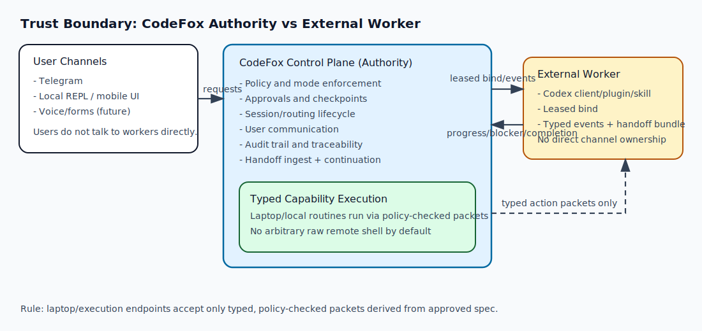

# CodeFox

**Secure remote developer delegation.**

CodeFox lets you start work at your desk, continue from your phone, and keep policy, approvals, and audit under your control.

## Who This Is For

- **Solo developer**: keep coding moving when away from your desk.
- **Tech lead**: delegate execution while keeping review/approval checkpoints.
- **On-call engineer**: run bounded checks and triage safely from mobile.

## 60-Second Quickstart

### Goal 1: Run work from Telegram

```bash
npm install
cp config/codefox.config.sample.json config/codefox.config.json
cp .env.example .env
npm run dev -- ./config/codefox.config.json
```

Stop background dev instance (no `ps` needed):

```bash
npm run dev:stop -- --config ./config/codefox.config.json
```

Then in Telegram:

```text
/repo <your-repo>
/mode active
/spec draft investigate failing CI on branch feature/foo
/spec approve
run full checks and summarize failures
```

What happens:
- CodeFox routes your request to Codex under the selected mode.
- You get concise progress/completion updates.
- Use `/details` for full technical context.

### Goal 2: Handoff desk work to phone

At your desk (same machine where CodeFox is running):

```bash
npm run handoff:cli -- --config ./config/codefox.config.json
```

Then in Telegram:

```text
/handoff show
/continue
```

What happens:
- CodeFox binds to the active external route, ingests handoff state, and continues remaining work.
- If multiple items exist, CodeFox defaults safely and lets you choose by id or index (`/continue 2`).

### Goal 3: Use local chat-like CLI

```bash
npm run cli -- --config ./config/codefox.config.json
```

Inside REPL:

```text
status
what changed in the last run?
:handoff
:continue rw-1
```

## Trust Boundary

CodeFox is the authority. External workers are executors.



## Common Use Cases

1. **Desk-to-pocket continuation**
- You are mid-feature in an external Codex client, leave your desk, and continue from Telegram with `/handoff` + `/continue`.

2. **Approval-gated risky step**
- Worker asks for approval before a mutating action; you decide with `/approve` or `/deny`.

3. **Fast incident triage**
- From phone, run bounded checks, gather logs, and post Jira updates without opening a laptop session.

## Current Limits

- Local UI is deferred; Telegram + local REPL are the active interfaces.
- Capability packs exist as policy contracts, but backend maturity differs by pack.
- Changelog-driven capability tracking is currently manual.
- Behavior can still depend on installed Codex CLI/runtime version.

## Documentation By Goal

- **Start/operate/troubleshoot**: [Manual](./docs/MANUAL.md)
- **Desk-to-pocket walkthrough**: [Demo: Remote Handoff](./docs/DEMO_REMOTE_HANDOFF.md)
- **One-page end-user story**: [Demo: One-Page Story](./docs/DEMO_ONE_PAGE_STORY.md)
- **Example transcript output**: [demo-outputs/remote-handoff-transcript.txt](./docs/demo-outputs/remote-handoff-transcript.txt)

## Product Statement

CodeFox converts messy human requests into structured, reviewable execution and runs them through policy-bounded workers with full approval and audit control.
